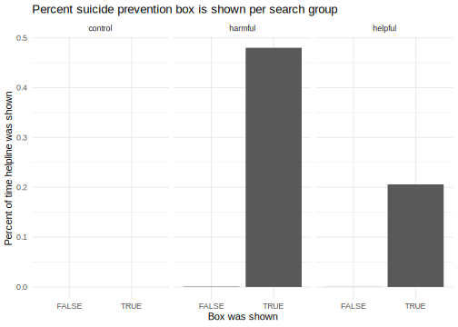

# Final project for NYU Data Science
## Reproduction of study on Google's suicide prevention

Paper: Equal access to online information? Google’s suicide-prevention disparities may amplify a global digital divide  
Link to paper: https://journals.sagepub.com/doi/full/10.1177/1461444818801010  
Link to original data: https://dataverse.harvard.edu/dataset.xhtml?persistentId=doi:10.7910/DVN/PCRG1D  

 
 

